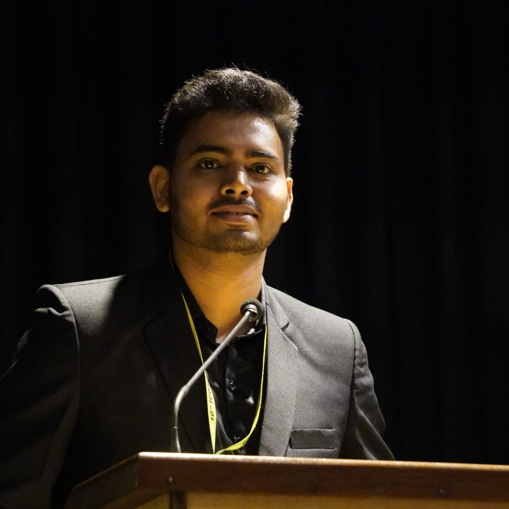

# 🎙️ Sunny Mondal — Podcast Landing Page

> **"The Blueprint for the Modern Indian Entrepreneur"**  
> A high-fidelity, premium podcast landing page built with pure HTML, CSS, and JavaScript.



---

## ✨ Overview

A fully responsive, dark-mode podcast landing page for **Sunny Mondal** — India's #1 business and personal growth podcast. Designed to convert visitors into listeners with bold typography, Electric Yellow accents, and high-energy micro-animations.

---

## 🎨 Design System

| Token | Value |
|---|---|
| **Primary Background** | `#0A0A0A` — Deep Charcoal |
| **Surface** | `#111111` / `#141414` |
| **Accent** | `#F7E200` — Electric Yellow |
| **Headline Font** | Montserrat 900 (via Google Fonts) |
| **Body Font** | Inter 300–600 (via Google Fonts) |

---

## 📂 Project Structure

```
podcast-landing/
├── index.html       # Full page markup — all 11 sections
├── style.css        # Design system, layout, animations
├── app.js           # Interactivity & micro-animations
├── host.png         # Hero image (Sunny Mondal)
└── README.md        # You are here
```

---

## 🏗️ Sections

| # | Section | Description |
|---|---|---|
| 1 | **Navbar** | Transparent → frosted glass on scroll. "Book Sunny" CTA |
| 2 | **Hero** | Bold headline, host photo, animated equalizer chip, 3 key stats |
| 3 | **Featured On** | Infinite auto-scrolling media logo marquee |
| 4 | **Episodes Grid** | 3-col layout with filter tabs, live search, and play buttons |
| 5 | **Embedded Players** | Spotify + YouTube iframes side by side |
| 6 | **Shorts & Clips** | Vertical TikTok-style clip cards with hover play overlays |
| 7 | **Guest Directory** | Searchable, filterable guest list |
| 8 | **Social Proof** | Stats (1M+, 350+, 4.9★) + rotating testimonials |
| 9 | **Newsletter** | Email signup with success animation |
| 10 | **Book the Host** | Guest application CTA with animated mic visual |
| 11 | **Footer** | Brand + social links + column navigation |
| — | **Audio Player Bar** | Sticky bottom bar — slides up when any episode is clicked |

---

## ⚡ Features

- **Zero dependencies** — pure HTML, CSS, and vanilla JavaScript
- **Sticky audio player bar** that slides up on episode click
- **Episode filtering** by category (Founders, Investors, Mindset, Finance)
- **Live search** across both episodes and guest directory
- **Rotating testimonials** with auto-cycle and dot navigation
- **Infinite scrolling marquee** for the "Featured On" bar
- **Scroll-reveal animations** via `IntersectionObserver`
- **Fully responsive** — mobile, tablet, and desktop
- **Glassmorphism navbar** on scroll
- **Newsletter form** with animated success state

---

## 🚀 Getting Started

Since this is a pure static site, no build step is required.

### Open locally
Simply open `index.html` in your browser:

```bash
# Option 1: Direct file open
start index.html

# Option 2: Serve with a local server (recommended for iframes)
npx serve .
# or
python -m http.server 8080
```

Then visit: [http://localhost:8080](http://localhost:8080)

---

## 🌐 Deployment

This site can be deployed to any static hosting platform:

### Vercel
```bash
npx vercel --prod
```

### Netlify
Drag and drop the `podcast-landing/` folder at [netlify.com/drop](https://netlify.com/drop)

### GitHub Pages
Push the folder to a GitHub repo and enable Pages in repository settings.

---

## 🔧 Customization

### Update the Spotify embed
In `index.html`, find `#spotifyEmbed` and replace the `src` URL with your own Spotify show link:
```html
src="https://open.spotify.com/embed/show/YOUR_SHOW_ID?utm_source=generator&theme=0"
```

### Update the YouTube embed
Find `#youtubeEmbed` and replace the playlist ID:
```html
src="https://www.youtube.com/embed/videoseries?list=YOUR_PLAYLIST_ID"
```

### Update social links
Search for `id="social-spotify"`, `id="social-youtube"`, `id="social-instagram"`, `id="social-twitter"` in `index.html` and update the `href` values.

### Update newsletter email
Find the `book@figuringout.in` mailto link and update it to your own email.

---

## 📱 Responsive Breakpoints

| Breakpoint | Layout |
|---|---|
| `> 1024px` | Full two-column hero, 3-col episode grid |
| `768px – 1024px` | Single-column hero, 2-col episode grid |
| `< 768px` | Stacked mobile layout, hamburger menu |
| `< 480px` | Single-column clips and stats grid |

---

## 🛠️ Tech Stack

- **HTML5** — Semantic markup
- **CSS3** — Custom properties, Grid, Flexbox, animations
- **Vanilla JavaScript** — ES6+, IntersectionObserver, DOM events
- **Google Fonts** — Montserrat + Inter

---

## 📄 License

© 2025 Sunny Mondal. All rights reserved.
